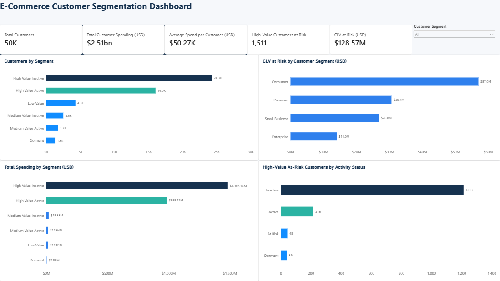

# E-Commerce Customer Segmentation 2026

An exploratory customer analytics project using Python and Power BI to identify valuable customer groups and prioritize retention opportunities.

## Dashboard

## 🔗 Business Objective

Understand which customers contribute the most spending and lifetime value, and identify high-value customers with elevated churn risk for targeted retention campaigns.

## Problem Statement

High-value customers contribute significantly to the business's overall customer value, making their potential churn a major concern. This project focuses on identifying high-value customers who are at risk of churning and measuring the customer lifetime value associated with these customers. The analysis provides insights that can help the business prioritize targeted retention efforts and reduce potential customer value loss.

## Tools

- Python: pandas, Matplotlib, and seaborn
- Google Colab: data preparation and exploratory analysis
- Power BI: dashboard development and visualization
- GitHub: project documentation

## Dataset

- Source: [E-Commerce Customer Segmentation 2026 on Kaggle](https://www.kaggle.com/datasets/datascikhan/e-commerce-customer-segmentation-2026)
- Author: Shair Khan
- Original size: 50,000 customer records and 53 features
- License listed on Kaggle: CC0 — Public Domain
- Coverage: customer profiles, purchasing behavior, loyalty, RFM scores, churn risk, customer lifetime value, and profitability

This project uses the dataset for educational portfolio analysis.

## Methodology

1. Inspected the dataset structure, data types, missing values, duplicate rows, and numeric ranges.
2. Confirmed 50,000 unique customer IDs and no duplicate rows.
3. Filled missing secondary and tertiary product preferences with "No Additional Preference."
4. Filled missing loyalty tiers with "No Loyalty Tier" and missing social media presence with "Unknown."
5. Compared customer counts, total spending, average spending, lifetime value, and profitability across customer groups.
6. Created a retention-priority flag and exported the prepared data for Power BI.
7. Built a dashboard covering customer distribution, spending, and retention risk.

### Retention-Priority Definition

A customer is classified as **High-Value At Risk** when both conditions are met:

- Customer value category is **High** or **Very High**.
- Churn risk category is **High** or **Very High**.

Activity status is analyzed separately, so an Active customer can still meet the risk definition.

## Dashboard KPIs

| Metric | Value |
|---|---:|
| Total customers | 50,000 |
| Total customer spending | $2.51 billion |
| Average spending per customer | $50.27K |
| High-value customers at risk | 1,511 |
| CLV associated with those customers | $128.57 million |

Values are rounded for display. Total spending reflects the dataset's cumulative spending field; it is not established as annual revenue.

## Key Findings

- **Retention exposure is concentrated:** 1,511 high-value customers have elevated churn risk, representing approximately $128.57 million in CLV.
- **Consumer customers represent the largest retention opportunity:** 674 priority customers account for approximately $57 million in CLV.
- **Most priority customers are inactive:** 1,213 of the 1,511 customers, approximately 80%, are classified as Inactive.
- **Diamond customers dominate spending:** this loyalty tier contributes approximately $1.92 billion, or 76% of total spending.
- **Broad customer segments have similar average spending:** Consumer customers lead total spending mainly because they form the largest customer group.

## Business Recommendations

1. Prioritize re-engagement campaigns for inactive, high-value customers with elevated churn risk.
2. Focus initial retention tests on Consumer customers because they represent the largest total CLV exposure.
3. Tailor loyalty benefits and personalized offers to valuable customer groups.
4. Measure campaign results using reactivation rate, repeat purchases, incremental margin, and campaign cost.

These are proposed actions based on exploratory findings, not measured campaign outcomes.

## Limitations

- Churn risk, CLV, RFM scores, and several segment labels are supplied by the dataset.
- This project analyzes those fields; it does not build or validate a predictive churn model.
- CLV at risk is the sum of CLV for flagged customers, not a probability-weighted forecast of losses.
- Associations between loyalty, behavior, and value do not establish causation.
- Missing-value replacements are analytical assumptions documented in the notebook.

## Project Files

- [Analysis notebook](Ecommerce_Customer_Segmentation_Analysis.ipynb)
- [Dashboard screenshot](ecommerce_customer_segmentation_dashboard.png)

## Reproduce the Python Analysis

1. Download the original CSV from the Kaggle source above.
2. Open the analysis notebook in Google Colab.
3. Upload the CSV to the Colab session.
4. Ensure the CSV filename matches the notebook's data-loading cell.
5. Run the analysis cells in order.

The notebook exports the prepared dataset as a CSV. Its final Excel-download cell requires a separately created Excel file and can be skipped when using the CSV export.
